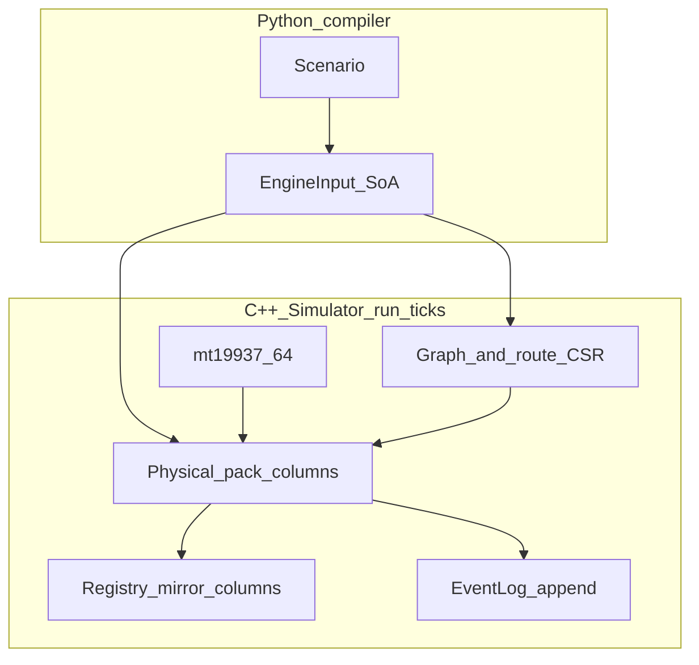

# PharmaSim (MVP)

### Problem overview

Model EU-wide pharmaceutical distribution to study cross-border theft and counterfeiting, starting from synthetic scenarios compatible in spirit with EMVO/NMVO-style data.

### MVP definition

Python defines policy and initial state; a C++ SoA kernel runs the simulation and an append-only event log. One EMVO hub, OBPs, wholesalers, local orgs (pharmacies/hospitals), and NMVOs appear as organization types on locations.

### Architecture

Policy → Compiler → Engine → Analytics → I/O

1. **Policy** (`python/policy/`): `Scenario`, locations, edges, packs.
2. **Compiler** (`python/compiler/`): validate, dense IDs, `EngineInput` columnar payload + route CSR.
3. **Engine** (`cpp/engine/`): pack/location state, phased `run_ticks`, events.
4. **Runtime** (`python/runtime/`): `native_bridge`, `simulation_viz`.
5. **Analytics** (`python/analytics/`), **schemas** (`schemas/`).

Users typically compile and run via `python/runtime` without hand-rolling the C++ ABI.

### End-to-end flow

`Scenario` → `compile_scenario` → `create_native_simulator` / `compile_and_create_native_simulator` → `run_ticks` → event log and optional reports via `simulation_viz`.

After changing C++ or the `EngineInput` layout: rebuild the extension (e.g. `scripts/setup.sh` or CMake + `nanobind` target) and reinstall the editable package (`uv pip install -e .`) so tests load a matching `_pharmasim_native`.

### EngineInput and schema

Stable ABI string `engine_input.v5`: keep `python/compiler/types.py` (`ENGINE_INPUT_SCHEMA_VERSION`) and `cpp/engine/enums.hpp` in sync when adding or reordering columns. Bindings must load every new field (`cpp/bindings/`).

### Simulation kernel (current)

- **Static inventory**: fixed `n_packs`; no runtime pack creation.
- **Per tick** (`Simulator::run_ticks`): (1) location phase — demand policies; (2) supply phase — supply policies and scheduled first hops; (3) shipment phase — due moves along edges (multihop via precomputed route CSR, `edge_lead_time_ticks`); (4) pack behavior — verify / decommission / reactivate probabilities per location. Stochastic per-pack graph walks exist in code but are **not** invoked from this tick loop.
- **Policies** (column `policy_id` + params): demand `0/1/2` (none, constant rate, Poisson on `location_demand_poisson_lambda`); supply `0/1/2` (none, wholesaler cap toward preferred edge if downstream backlog, OBP pool activation then ship). First-hop moves respect per-edge `edge_capacity` within the tick.
- **Registry**: mirrored from physical state in v1; not full NMVS/EMVO API fidelity.

Design notes: `simulation_realism.md`.

### Directory structure

| Path                | Role                                                         |
| ------------------- | ------------------------------------------------------------ |
| `python/policy/`    | Scenarios and models (`scenarios_large.py` for stress cases) |
| `python/compiler/`  | AoS → SoA compile                                            |
| `python/runtime/`   | Native bridge, `simulation_viz.py`                           |
| `python/analytics/` | Reports                                                      |
| `cpp/engine/`       | Kernel                                                       |
| `cpp/bindings/`     | nanobind module                                              |
| `schemas/`          | Version and enum docs                                        |
| `tests/`            | pytest: compiler, validate, dynamics, bridge, viz            |

Tooling: **uv** (Python), **CMake** + **Ninja** (C++ / extension).

### Logs and visualization

See `python/runtime/native_bridge.py` and `python/runtime/simulation_viz.py`: `events_as_records`, `export_run_report`, `run_ticks_with_hook`, optional plots (`uv sync --extra viz`).

### Usage

- `scripts/setup.sh` — uv env + CMake build of `_pharmasim_native`
- `scripts/run_simulation.sh` — example scripted run
- `uv run pytest` — full test suite (`pyproject.toml` sets `pythonpath` for `python/`)
- `uv run pytest tests/bench.py --benchmark-only` — benchmarks

@Han Wu [hanwuh@ethz.ch](mailto:hanwuh@ethz.ch)