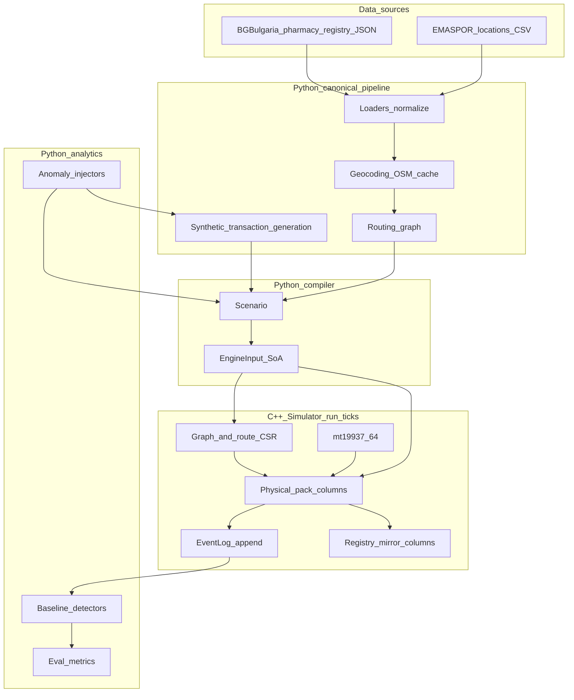

# PharmaSim (MVP)

### Problem overview

Model EU-wide pharmaceutical distribution to study cross-border theft and counterfeiting, starting from synthetic scenarios compatible in spirit with EMVO/NMVO-style data.

### MVP definition

Python defines policy and initial state; a C++ SoA kernel runs the simulation and an append-only event log. One EMVO hub, OBPs, wholesalers, local orgs (pharmacies/hospitals), and NMVOs appear as organization types on locations.

### Architecture

> **Note (2026-06-02):** The `canonical` data pipeline and transaction/experiment scaffolding are currently implemented entirely in Python for fast iteration. These modules may later be partially migrated into the C++ engine if per-tick injection of anomalies or richer event semantics is needed. The native `engine_input.v6` ABI was intentionally left unchanged during this pass to keep risk low.

Data sources → Canonical pipeline → Policy/Scenario → Compiler → Engine → Analytics → I/O

1. **Canonical** (`python/canonical/`): ETL loaders (BG pharmacy registry JSON, EMA SPOR CSV), geocoding with OSM cache, geography-aware routing, Bulgaria scenario assembly, synthetic transaction generation, experiment bundle orchestration. Currently Python-only; may partially migrate to C++ later.
2. **Policy** (`python/policy/`): `Scenario`, locations, edges, packs, transaction lifecycle contracts (`TransactionIntent`, `TransactionPlan`, `AnomalyLabel`).
3. **Compiler** (`python/compiler/`): validate, dense IDs, `EngineInput` columnar payload + route CSR.
4. **Engine** (`cpp/engine/`): pack/location state, phased `run_ticks`, events.
5. **Runtime** (`python/runtime/`): `native_bridge`, `simulation_viz`.
6. **Analytics** (`python/analytics/`): anomaly injection (volume spikes, cross-market), baseline detectors (z-score, market mismatch), evaluation metrics (precision/recall/F1).

Users typically compile and run via `python/runtime` without hand-rolling the C++ ABI.

### End-to-end flow

**Data-driven workflow (new):**

`data/data.json` + `data/spor_locations.csv` → `bulgaria_registry_scenario()` / `bulgaria_registry_experiment_bundle()` → `compile_scenario` → `create_native_simulator` → `run_ticks` → event log and reports.

**Synthetic workflow (existing):**

`two_markets_demo()` or `multi_market_sparse_scenario()` → `compile_scenario` → same engine path.

After changing C++ or the `EngineInput` layout: rebuild the extension (e.g. `scripts/setup.sh` or CMake + `nanobind` target) and reinstall the editable package (`uv pip install -e .`) so tests load a matching `_pharmasim_native`.

### EngineInput and schema

Stable ABI string `engine_input.v6`: keep `python/compiler/types.py` (`ENGINE_INPUT_SCHEMA_VERSION`) and `cpp/engine/enums.hpp` in sync when adding or reordering columns. Bindings must load every new field (`cpp/bindings/`).

### Simulation kernel (current)

- **Static inventory**: fixed `n_packs`; no runtime pack creation.
- **Per tick** (`Simulator::run_ticks`): (1) location phase — demand policies; (2) supply phase — supply policies and scheduled first hops; (3) shipment phase — due moves along edges (multihop via precomputed route CSR, `edge_lead_time_ticks`); (4) pack behavior — verify / decommission / reactivate probabilities per location. Stochastic per-pack graph walks exist in code but are **not** invoked from this tick loop.
- **Policies** (column `policy_id` + params): demand `0/1/2` (none, constant rate, Poisson on `location_demand_poisson_lambda`); supply `0/1/2` (none, wholesaler cap toward preferred edge if downstream backlog, OBP pool activation then ship). First-hop moves respect per-edge `edge_capacity` within the tick.
- **Registry**: mirrored from physical state in v1; not full NMVS/EMVO API fidelity.

Design notes: `simulation_realism.md`.

### Next steps:
- Enrich event log with transaction/order semantics for richer observability
- Push anomaly injection into per-tick engine loop (currently pre-computed in Python)
- Migrate stable canonical pipeline pieces into C++ EngineInput columns if scalability demands it
- different order policies by different medicine types -- substitutability of medicines by `ATC (Anatomical Therapeutic Classification)` (prefix tree data structure)
- More complex/realistic `WHOLESALER` logic for allocation, fairness
- More complex/realistic `OBP` production behavior, perhaps with production scheduling
- More realistic/complex penalty (modular, so can be switched for experimentation)
- Advanced detector methods beyond z-score / rule baselines
#### Decided
- Real actor location data
  - SPOR (European Medicines Agency) — **implemented** in `python/canonical/loaders.py`
  - Bulgarian pharmacy registry — **implemented** in `python/canonical/loaders.py`
- Geocoding via OpenStreetMap — **implemented** with cache in `python/canonical/geocoding.py`
- Fraud detection given data visible to NMVOs, EMVO — **scaffolded** in `python/analytics/fraud.py`
- Synthetic transaction lifecycle with anomaly injection — **implemented** in `python/canonical/transactions.py`
- Visualizations
- --> argue based on plausibility of simulation

### Directory structure

| Path                | Role                                                         |
| ------------------- | ------------------------------------------------------------ |
| `python/canonical/` | BG data loaders, OSM geocoding, routing, scenario assembly, synthetic transaction generation, experiment bundles |
| `python/policy/`    | Scenarios, models, transaction lifecycle contracts (`transactions.py`) |
| `python/compiler/`  | AoS → SoA compile                                            |
| `python/runtime/`   | Native bridge, `simulation_viz.py`                           |
| `python/analytics/` | Reports, anomaly injection & detection (`fraud.py`)          |
| `cpp/engine/`       | Kernel                                                       |
| `cpp/bindings/`     | nanobind module                                              |
| `schemas/`          | Version and enum docs                                        |
| `tests/`            | pytest: canonical pipeline, transactions, compiler, validate, dynamics, bridge, viz |

Tooling: **uv** (Python), **CMake** + **Ninja** (C++ / extension).

### Logs and visualization

See `python/runtime/native_bridge.py` and `python/runtime/simulation_viz.py`: `events_as_records`, `export_run_report`, `run_ticks_with_hook`, optional plots (`uv sync --extra viz`).

### Usage

- `scripts/setup.sh` — uv env + CMake build of `_pharmasim_native`
- `scripts/run_simulation.sh` — example scripted run
- `uv run pytest` — full test suite (`pyproject.toml` sets `pythonpath` for `python/`)
- `uv run pytest tests/bench.py --benchmark-only` — benchmarks

@Han Wu [hanwuh@ethz.ch](mailto:hanwuh@ethz.ch)