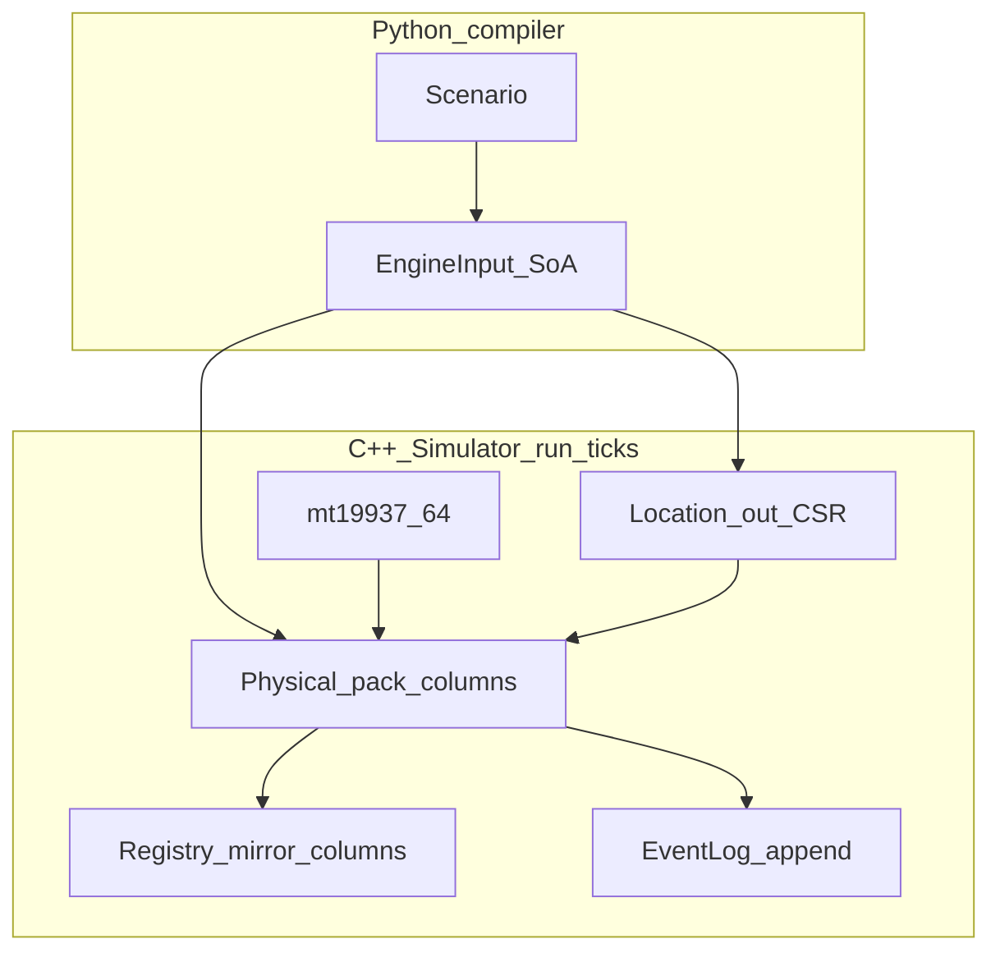

### Problem Overview 
The end goal is to model the pharmaceutical distribution network EU-wide to detect cross-border theft/counterfeiting of pharmaceuticals. 

### MVP Definition
The first step is to provide a proof of concept using synthetic data to fix the general architecture of the project, with 1 EMVO as the central hub for information and multiple agents of types: OBP (On-Board-Partners, here domestic or international manufacturers), WHOLESALER (distributors), LOCAL_ORG (pharmacies, hospitals), and NMVOs.
We will try to make the synthetic data as compatible/realistic as possible as the format used by the EMVO and NMVOs.

We want to combine the ease-of-use and mature library ecosystem of data processing and visualization in Python, while sidestepping the performance issues that Python's interpreted nature and the GIL impose. To do so, we separate the problem into "policy" vs "mechanism", where we define the policy and initial state using python, and leave the execution to custom C++ modules.

In this MVP we implement a simplified version to showcase this approach, with agent characteristics/functionality.

### Architecture
Policy -> Compiler -> Engine -> Analytics -> I/O
1. Policy (Python): initialize scenario, agent behavioral rules
2. Compiler (Python): validate policy, assign IDs, output engine-ready columns.
3. Engine (C++): SoA simulation kernel, transition rules, maintain EMVS-style transaction log
4. Analytics (runtime/simulation.viz.py + Simulator accessors): report builders over event log -> EMVS style transaction + metric reports
5. I/O:  I/O  

Typically, users author `Scenario` and consume logs/metrics; they should not have to access the engine outside of simple invocations via `python/runtime`.

#### End-to-end flow:
`Scenario` → `compile_scenario` → `create_native_simulator` / `compile_and_create_native_simulator` → `run_ticks` → logs via `simulation_viz` (and `PYTHONPATH=python` / editable install caveat).

#### Simulation Architecture sketch (MVP data flow)


Static EngineInput (no runtime batch/pack creation); 
per-tick loop: behavior (optional VERIFY / DECOMMISSION / REACTIVATE), movement on a CSR graph, UPLOADED→ACTIVE at wholesaler; 
registry mirror = physical in v1; not full NMVS/EMVO API fidelity

### Directory Structure
```python/policy/``` - scenario authoring models and rules (see ``policy/scenarios_large.py`` for multi-market sparse stress scenarios)
```python/compiler/``` - AoS -> SoA compile pipeline
```python/runtime/``` - Python-facing wrapper around C++ engine
```python/analytics/``` - report generation and validation
```cpp/engine/``` - SoA state, transition logic, simulator loop
```cpp/bindings/``` - nanobind interface
```schemas/``` - schema versions and enum docs
```tests/``` - unit + replay + golden report tests

The python portion is managed by uv
The C++ portion is managed by CMake
Nanobind is used to expose cpp modules to python

### Simulation logs and visualization
The native engine stores an append-only event log and exposes it on ``Simulator`` (see ``runtime/native_bridge.py``). For human-readable tables, CSV/JSONL export, per-tick debug printing, and optional matplotlib plots, use ``python/runtime/simulation_viz.py``:

- End of run: ``events_as_records``, ``dump_debug_report_to_string``, ``export_run_report(sim, inp, out_dir)``.
- During run: ``run_ticks_with_hook(sim, inp, n, on_tick)`` with ``print_tick_debug`` or your own callback (advances one tick at a time).
- Plots (optional): ``uv sync --extra viz`` or ``pip install matplotlib``, then ``plot_event_timeline`` / ``plot_physical_locations``.

### Usage
Run `scripts/setup.sh` to setup correct python environment + CMake/Ninja

Run `scripts/run_simulation.sh` to run simulation. Parameters are easily modifiable.

Run `uv run pytest` for all tests

Run `uv run pytest tests/bench.py --benchmark-only` to run `pybench` benchmark.


@Han Wu hanwuh@ethz.ch
